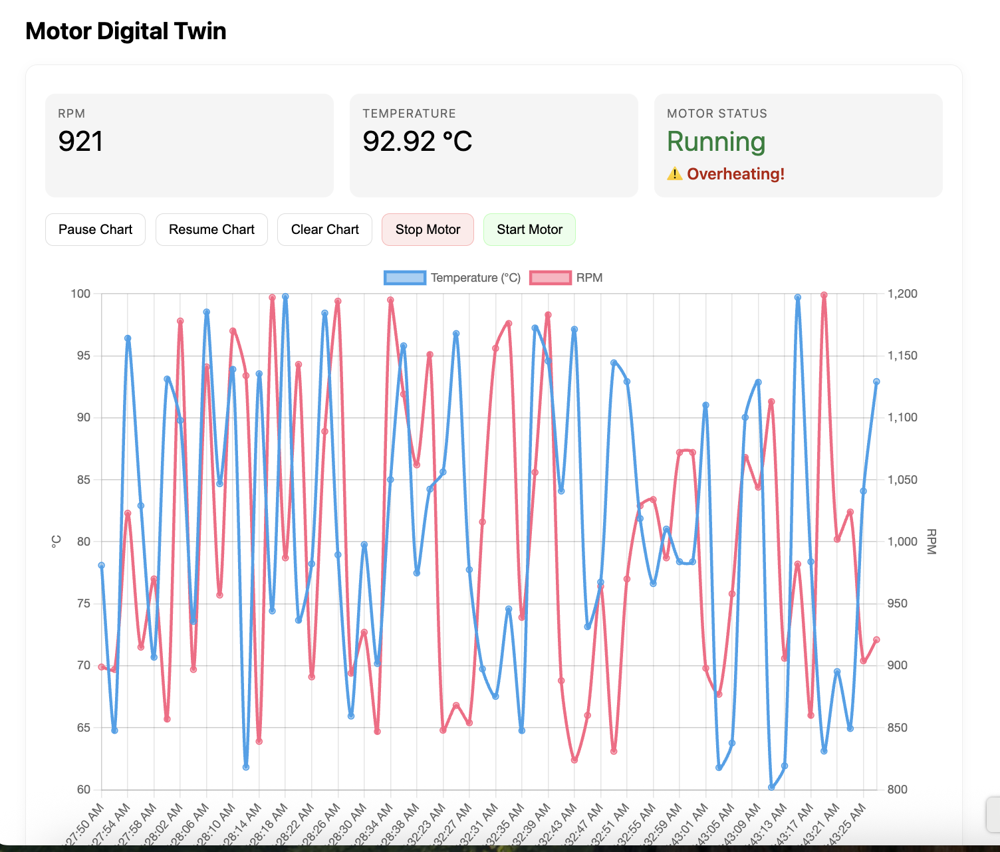

# Motor Digital Twin

A minimal, demo-friendly **Digital Twin**: a simulated **motor** streams live telemetry (RPM, Temperature) to a Flask + Socket.IO server that renders a **real-time dashboard** with a line chart, **overheating alert**, and **Start/Stop** motor control (bidirectional loop).

> Perfect for trainings, classrooms, and quick customer demos.

## ✨ Features

- **Live telemetry** (RPM, Temperature) every 1–2 seconds  
- **Real-time dashboard** (Chart.js) with Pause / Resume / Clear chart  
- **Overheating alert** when Temp > 90 °C  
- **Bidirectional control**: Stop / Start motor from the UI  
- **Zero external services** — all local, no accounts required

---

## 🖼️ Screenshot

> Place your screenshot at `docs/screenshot.png` and uncomment below.

<!--  -->

---

## 🧱 Architecture

```
+-----------------+       Socket.IO (websocket/polling)        +------------------+
| motor_sim.py    |  --->  "motor_data" events (RPM, Temp) ---> |  Flask-SocketIO  |
| (simulated      |                                            |  app.py          |
|  physical asset)|  <---  "motor_command" (start/stop)   <---  |  update UI       |
+-----------------+                                             +------------------+
        |                                                               |
        |                                            serves HTML/JS     |
        |-------------------------------------------------------------->|
                                                             templates/index.html (Chart.js UI)
```

---

## 🚀 Quick Start

### Requirements
- Python **3.11+**
- macOS / Linux / Windows

### 1) Clone & enter
```bash
git clone https://github.com/appars/motor-digitaltwin.git
cd motor-digitaltwin
```

### 2) Create & activate venv
```bash
python3 -m venv venv
# macOS/Linux
source venv/bin/activate
# Windows (PowerShell)
# .\venv\Scripts\Activate.ps1
```

### 3) Install dependencies
```bash
pip install -r requirements.txt
# (Client may also need these)
pip install websocket-client requests
```

### 4) Start the server (dashboard)
```bash
python app.py
```
By default this runs on **http://localhost:5050** (port can be adjusted in `app.py`).

> **macOS tip:** Port 5000 is often taken by AirPlay Receiver. Using **5050** avoids that conflict.

### 5) Start the simulator (in a second terminal)
```bash
# In repo root again, and ensure venv is active
source venv/bin/activate
python motor_sim.py
```

Open **http://localhost:5050** in your browser.  
You should see RPM & Temperature update every ~1–2 seconds.

---

## 🕹️ Demo Flow

1. Show live numbers & the line chart.  
2. Click **Stop Motor** → the simulator pauses (terminal shows “Motor is stopped…”).  
3. Click **Start Motor** → streaming resumes.  
4. Trigger alert by bumping temperature range in `motor_sim.py`:
   ```python
   "temperature": round(random.uniform(92, 110), 2)
   ```
   The UI will show **⚠️ Overheating!**

---

## ⚙️ Configuration

- **Simulator URL**  
  `motor_sim.py` connects to `http://localhost:5050` by default.  
  Override with an env var:
  ```bash
  export TWIN_URL=http://localhost:5050
  python motor_sim.py
  ```

- **Server port**  
  Set in `app.py`:
  ```python
  socketio.run(app, host="0.0.0.0", port=5050, debug=True)
  ```

---

## 📁 Project Structure

```
.
├── app.py                   # Flask + Flask-SocketIO server (the twin)
├── motor_sim.py             # Motor telemetry simulator (client)
├── requirements.txt         # Python deps (server + client)
├── templates/
│   └── index.html           # Dashboard UI (Chart.js + Socket.IO)
├── run_server.sh            # Convenience script (macOS/Linux)
├── run_sim.sh               # Convenience script (macOS/Linux)
└── docs/
    └── screenshot.png       # (optional) add your screenshot here
```

> Make scripts executable (macOS/Linux):  
> `chmod +x run_server.sh run_sim.sh`

---

## 🧩 Tech Stack

- **Flask 3** + **Flask-SocketIO 5**
- **python-socketio 5** (client & server)
- **Chart.js 4** (CDN) for charts
- **Vanilla JS** UI

---

## 🛠️ Troubleshooting

- **Dashboard shows 0/“Waiting for data”**  
  - Confirm both processes are running and in the **same venv**.  
  - Check server logs for `[TELEMETRY] {...}` — if present, the server is receiving data.  
  - Browser hard refresh: **Cmd+Shift+R** (clears cached JS).

- **Client error: `requests package is not installed`**
  ```bash
  pip install requests websocket-client
  ```

- **Socket.IO connection errors**  
  - Ensure `http://localhost:5050` is reachable in browser.  
  - Some VPNs/AdBlockers block websockets/CDNs. Try a different network or disable temporarily.

- **macOS port conflict (5000)**  
  - We use **5050** by default. (Or disable System Settings → General → AirDrop & Handoff → AirPlay Receiver.)

---

## 🧭 Roadmap (nice add-ons)

- CSV export & simple SQLite history  
- Multi-asset dashboard (Motor + Pump)  
- Dockerfile and/or Azure App Service deploy  
- Anomaly detection (simple threshold or moving z‑score)

---

## 🤝 Contributing

Issues and PRs welcome. Keep it lightweight and demo-friendly.

---

## 📜 License

MIT. See `LICENSE`.
